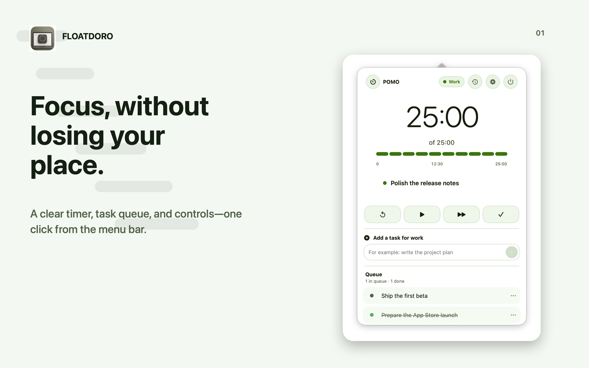

# Floatdoro



Floatdoro is a native, local-first focus timer for macOS. It lives in the menu
bar and can keep a compact, resizable timer above your other windows while you
work.

## Install

1. Open the [latest GitHub Release](https://github.com/drenderyga-del/floatdoro/releases/latest).
2. Download the macOS ZIP file from **Assets**.
3. Unpack the ZIP and move the application to the Applications folder.
4. Open the application and look for its countdown in the macOS menu bar.

Release builds are signed and notarized by Apple.

## Features

- Menu bar countdown with quick timer controls
- Floating timer that stays above other windows and across workspaces
- Resizable floating panel with the current task and task queue
- 25/5, 50/10, and 90/20 presets plus custom focus and break durations
- Optional automatic break start when a focus interval ends
- Lightweight task queue and weekly focus history
- Light and dark appearances
- System notifications, completion sounds, and optional launch at login
- Local storage with no account, analytics, advertising, or tracking

## Build from source

### Requirements

- macOS 14 Sonoma or newer
- Xcode Command Line Tools or Xcode with Swift 6

Install the command-line tools if they are not already available:

```sh
xcode-select --install
```

### Run

Clone the repository and launch Floatdoro with Swift Package Manager:

```sh
git clone https://github.com/drenderyga-del/floatdoro.git
cd floatdoro
swift run Floatdoro
```

Floatdoro is a menu bar utility, so it does not show an icon in the Dock. Look
for the countdown in the macOS menu bar after launching it.

### Create an application bundle

Create a local `.app` bundle:

```sh
./scripts/package_app.sh
open outputs/Floatdoro.app
```

The application is written to `outputs/Floatdoro.app` and receives an ad-hoc
signature suitable for local use. To install it, move `Floatdoro.app` to the
Applications folder.

To set a custom version:

```sh
./scripts/package_app.sh 1.0.0
```

### Develop in Xcode

The Xcode project is generated from `project.yml` using
[XcodeGen](https://github.com/yonaskolb/XcodeGen):

```sh
brew install xcodegen
xcodegen generate
open Floatdoro.xcodeproj
```

Choose the `Floatdoro` scheme and run the app on `My Mac`.

### Tests

Run the test suite with:

```sh
swift test
```

The tests cover timer behavior, task progression, focus history, custom
durations, floating-window visibility, and migration of existing local data.
The Xcode project also contains the same test target, so the release scheme
executes the tests through `xcodebuild` as well.

### App Store release preflight

Before creating an archive or uploading to TestFlight, run the preflight with
the exact marketing version and build number:

```sh
./scripts/preflight_release.sh 1.0.2 8
```

This runs both Swift Package and Xcode tests, regenerates the Xcode project,
and validates the Info.plist, privacy manifest, entitlements, and export
options. It does not upload anything to App Store Connect.

## Project structure

- `Sources/Pomo` — application source code
- `Tests/PomoTests` — automated tests
- `Resources` — app icon, entitlements, privacy manifest, and `Info.plist`
- `scripts/package_app.sh` — local `.app` bundle builder
- `project.yml` — XcodeGen project configuration

## Local data and privacy

Timer state, tasks, preferences, and focus history are stored locally on the
Mac. Floatdoro does not require an account and does not include analytics,
advertising, tracking, or third-party SDKs.

## Contributing

Bug reports and pull requests are welcome. When changing behavior, add or
update tests where practical and run `swift test` before opening a pull
request.
